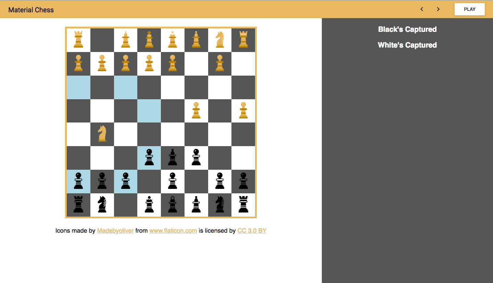

# React Chess

Welcome to React chess! This is a small experiment I started over spring break. The backend in written in python and implements alpha-beta pruning to play a game of chess. The frontend is written in React using Material-UI. It connects to the python process using websockets and plays a game of chess against itself. Right now the AI is pretty bad because the evaluation function is quite simple. In the future I may update it to make it a more formidible opponent / add the ability to play against the AI.

### Getting it Runnning

In one terminal window, cd into the client directory and run `npm start` or `yarn start`. In another, cd into the server directory and run `FLASK_APP=app.py python3 -m flask run`. Note that you will need to run `pip install flask flask-socketio` if you don't have these modules already. A browser window should open, and it should say that the server connected. Simply hit play and watch the game.

### TODO

- [ ] Add ability to play against the AI
- [ ] Improve the evaluation function
- [ ] Flesh out the UI
